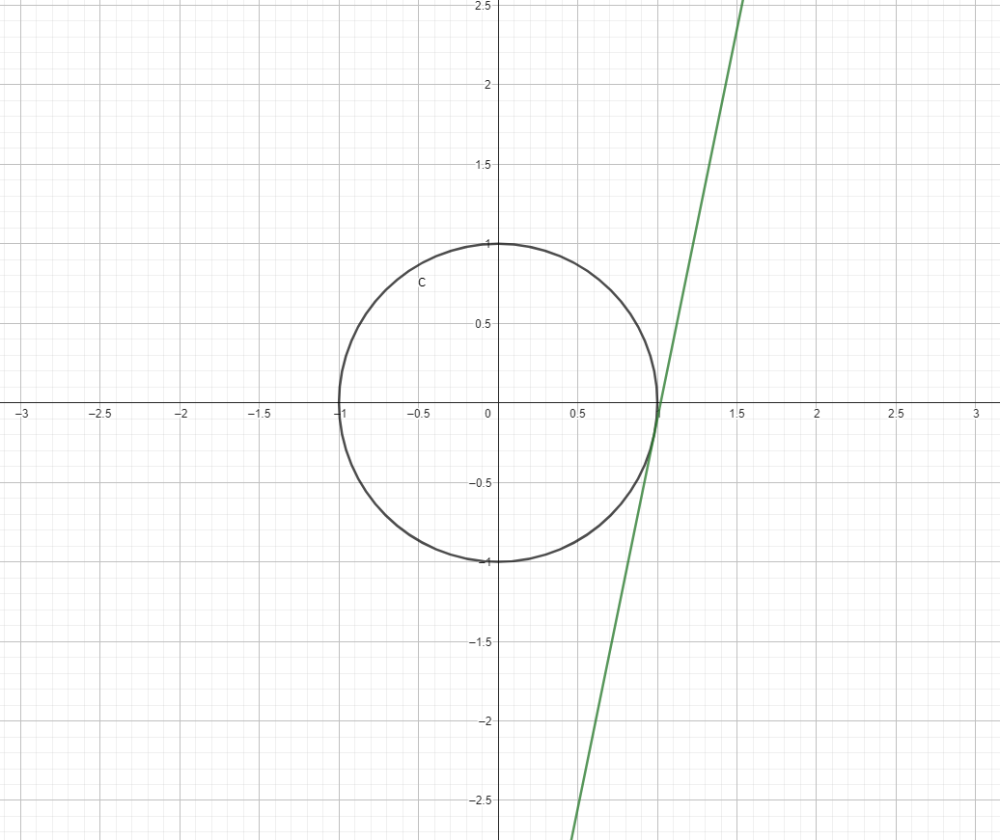

Aby znaleźć współczynnik kierunkowy \( m > 0 \) prostej \( y = mx - 5 \), która jest styczna do okręgu \( x^2 + y^2 = 1 \), postępujemy następująco:

### Krok 1: Wyraź równanie prostej w postaci ogólnej
Równanie \( y = mx - 5 \) w postaci ogólnej to:

$$
mx - y - 5 = 0.
$$

### Krok 2: Odległość prostej od środka okręgu
Środek okręgu to punkt \( (0, 0) \), a promień okręgu wynosi \( 1 \). Warunek styczności oznacza, że odległość od środka okręgu do prostej musi być równa promieniowi.

Odległość punktu \( (0, 0) \) od prostej \( mx - y - 5 = 0 \) obliczamy wzorem:

$$
d = \frac{|0 \cdot m - 0 - 5|}{\sqrt{m^2 + (-1)^2}} = \frac{5}{\sqrt{m^2 + 1}}.
$$

Warunek styczności to \( d = 1 \). Otrzymujemy równanie:

$$
\frac{5}{\sqrt{m^2 + 1}} = 1.
$$

### Krok 3: Rozwiąż równanie
Podnosimy obie strony równania do kwadratu:

$$
\left(\frac{5}{\sqrt{m^2 + 1}}\right)^2 = 1^2,
$$

co daje:

$$
\frac{25}{m^2 + 1} = 1.
$$

Mnożymy przez \( m^2 + 1 \):

$$
25 = m^2 + 1.
$$

Przekształcamy równanie:

$$
m^2 = 24.
$$

Bierzemy pierwiastek:

$$
m = \sqrt{24} = 2\sqrt{6}.
$$

### Krok 4: Wybierz \( m > 0 \)
Ponieważ \( m > 0 \), ostateczny wynik to:

$$
m = 2\sqrt{6}.
$$

